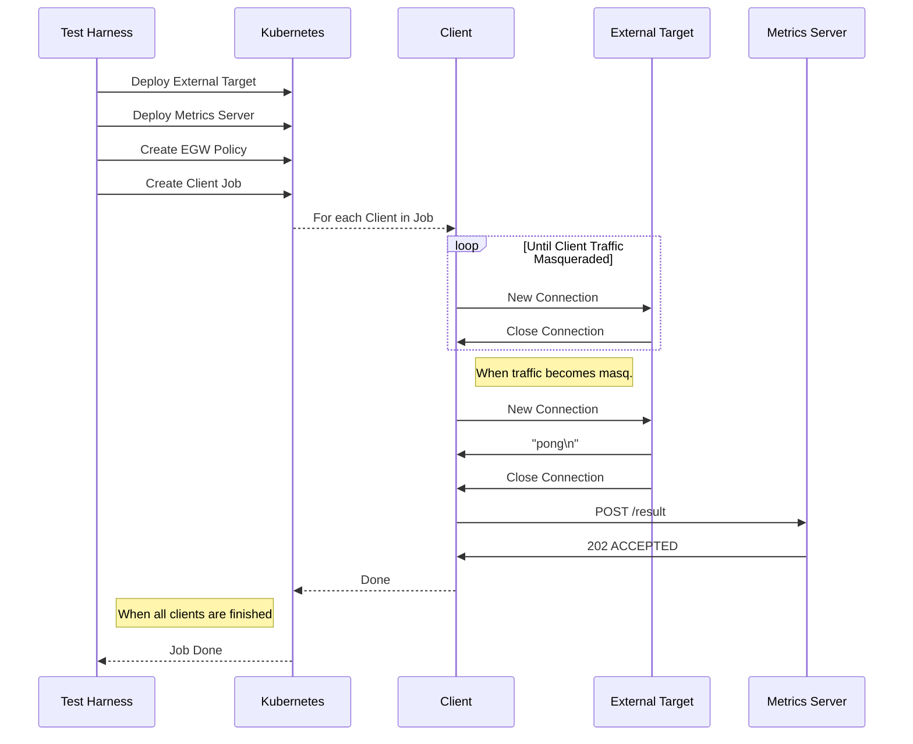

# EGW Scale Tests

This directory contains components that can be used for scale testing EGW and a local kind-based setup for development and testing.

## Tests

### Masquerade Delay

The masquerade delay tests seeks to answer the following questions:

1. How long does it take for a new Pod to have its traffic routed through an EGW Node, with an existing policy in place?
2. How many non-masqueraded network requests can a Pod make before its traffic is routed through an EGW Node?

To run the test locally on a kind cluster, use the `run.sh` script provided.

To run a baseline test where 10 clients connect to an external target without EGW:

```bash
$ ./run.sh masq-delay-baseline 10
```

To run a test where 10 clients connecto to an external target through EGW:

```bash
$ ./run.sh masq-delay 10
```

Results are store in `./artifacts`.

The flow of the test looks like this:



Each component of the test is detailed as follows:

#### 1. The Metrics Server

The metrics server is used for collecting and exporting results from the test. It's composed of an HTTP endpoint, which clients use to sumbit their results to, and a scrapable Prometheus target, which exports metrics specific to the test based on the gathered results.

#### 2. The External Target

The external target is responsible for mocking a target external to the cluster which workloads would make requests towards through an EGW Node. Using a target that lies on the public internet, such as `1.1.1.1` is not desirable because:

1. The probability of varying network latency between the test workload pods and the external target is high, which could impact the stability of the results.
2. The external network target could face down-time, impacting the availability of the test.
3. The difficulty of determining if a request was masqueraded through an EGW Node increases.

The external target for this test is a simple TCP server that takes requests on a pre-configured port and returns the string `pong\n` if the source IP of the request is part of a pre-configured CIDR.

This allows for test clients to easily judge if their request was masqueraded through an EGW Node, as the external target can be configured to only respond to requests with the `pong\n` string from an EGW Node.

An alternative option would be to create a firewall rule via iptables that blocks traffic from a Pod which wasn't masqueraded through an EGW Node, however this option may not be as platform-agnostic, may be tricky to debug, and requires additional work during cluster deployment.

The external target is run inside of the test cluster on a node configured without Cilium, inside of the node's host network. This technique was developed by the EGW team for testing and it substantially eases the deployment of the external target. When creating clusters using a cloud provider, such as GKE, the node configured without Cilium must have its `node.kubernetes.io/not-ready` taint removed, otherwise the cloud provider's control plane may believe the node has failed to provision and try to recreate it.

#### 3. The Client

The client represents a workload Pod in a cluster which has its traffic redirected through an EGW Node. The client pod performs the following when it starts:

1. Save the current time to understand when the client started executing.
2. Continually attempt to make a request to the external target. If the request wasn't masqueraded, increment an internal "missed requests" counter, wait, and try again. If the request was masqueraded, save the current time to understand when the client's traffic successfully started being redirected through an EGW Node.
3. Submit a request to the metrics server component detailing the client's results.
4. Exit.

Client pods are run as part of a Kubernetes Job, which helps to control cleanup and parallel execution.